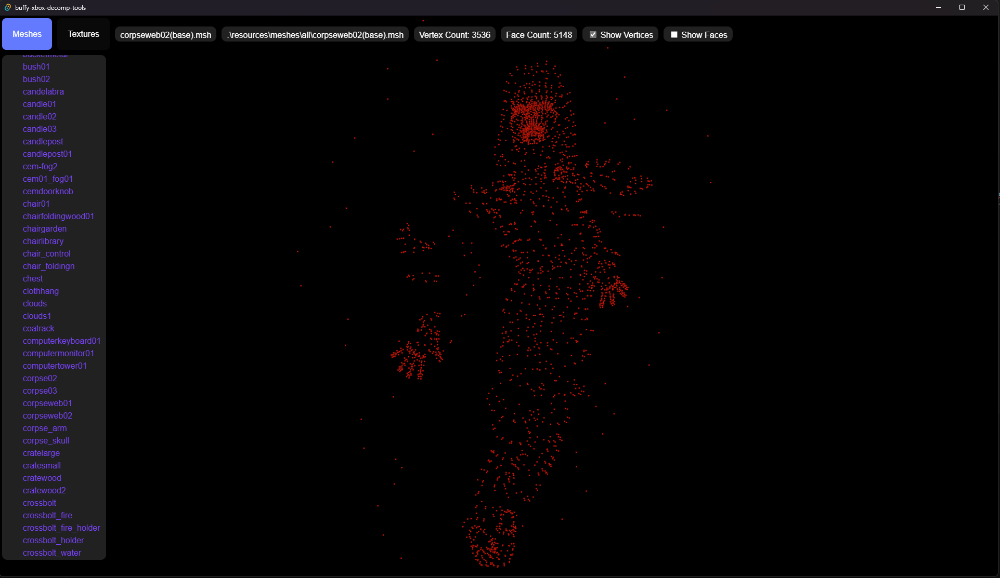
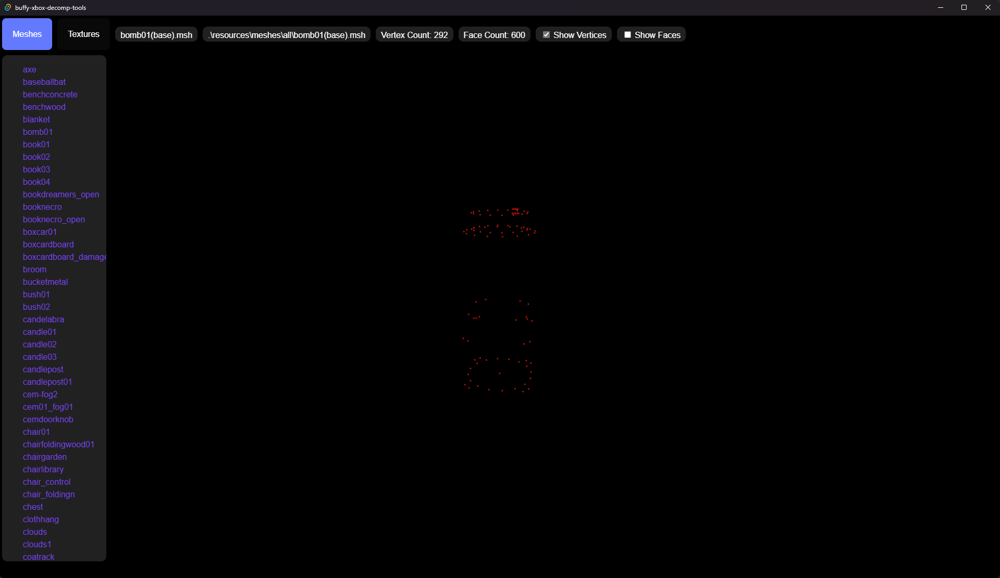
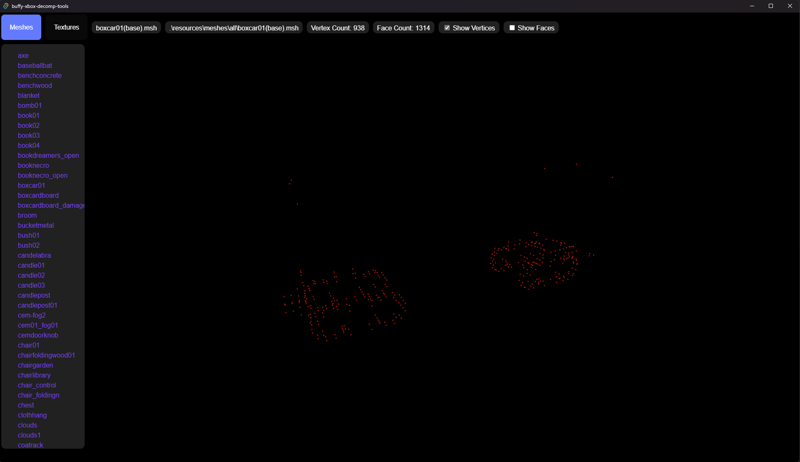

# Buffy XBOX Tools
This repository is mostly a way to help me learn how file structures and Tauri works.

This program currently only extracts vertices for certain MSH files which are used for the Slayer Engine that Buffy the Vampire Slayer was created in.

I believe I'm also currently extracting the faces correctly, however they do no render as expected when enabled. So either my parsing is incorrect or I need to re-order the faces array.

Svelte and THREE.js are used to render on the frontend. Tauri is used on the backend to load and parse the files.

I will update this repository in the future with the known file structure of MTX, MSH, and STL files.

# Buffy Assets
You will need to provide the asset files yourself, and place them in the ./src-tauri/resources/meshes/all directory.

To get the assets you will need to extract the data from a backed up copy of your Buffy game. You can use [XDVDMulleter](https://archive.org/details/XDVDMulleterBeta10.2) to extract your ISO.
Once you have extracted your backup copy you will need to use QuickBMS to extract the PAK files. You can find QuickBMS [here](https://github.com/LittleBigBug/QuickBMS).
You can find the script to extract PAK files [here](https://aluigi.altervista.org/bms/buffy_2002_pak.bms)

# Building
Clone the github repo
From the root of the project directory run "npm install"
After npm install is completed run "npm run tauri dev"

# Contributing
If you would like to contribute to the future work of this project, feel free to make a pull request. With my full-time job it might take a litle bit of time to review and merge them.

For discussion around the file structures and how to parse them feel free to open an issue and we can discuss.

# Screenshots

